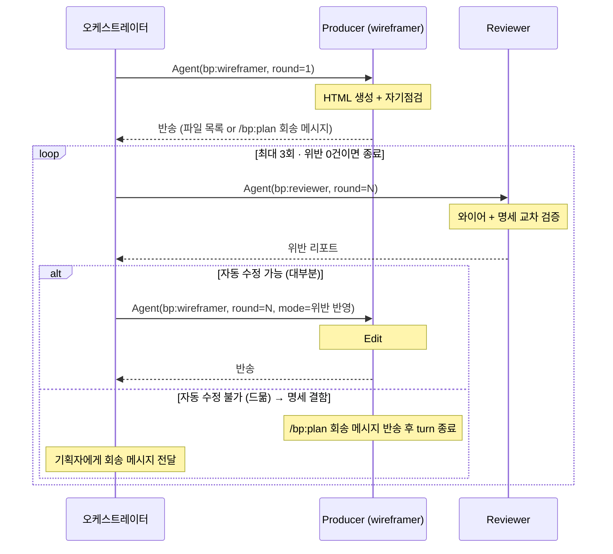

# wireframe-harness — /bp:wireframe 오케스트레이션

이 스킬은 "/bp:wireframe 이 어떻게 흘러야 하는가" 를 정한다. `wireframe` 스킬이 HTML 출력 형식을 정한다면, 이 스킬은 **실행 흐름 + 기획자 경험** 을 정한다.

## 적용 범위

- `/bp:wireframe` 커맨드 실행 흐름 (오케스트레이터 = 커맨드를 돌리는 Claude Code 본인)
- `bp:wireframer` agent 의 HTML 생성 + 재spawn 시 맥락 복원 처리
- `bp:reviewer` agent 의 wireframe 산출물 검토 분류 기준

## 공식 제약 (설계 전제)

https://code.claude.com/docs/en/sub-agents:
> "Subagents cannot spawn other subagents."

즉 wireframer subagent 는 `Agent(bp:reviewer)` 를 spawn 할 수 없다. **모든 Agent 호출은 오케스트레이터가 전담**한다.

> `Task` tool 은 v2.1.63 에서 `Agent` 로 리네임됐고 `Task(...)` 는 하위호환 alias 다. 본 문서는 공식 이름 `Agent` 로 표기.

## 체이닝 모델 (v3.0.0 핵심)

수렴 루프에서 wireframer 재진입은 **매 라운드 새 `Agent(bp:wireframer)` spawn** 으로 처리. 생성된 HTML 파일이 durable state 역할을 하므로 세션 연속성 불필요. SendMessage 기반 재진입은 사용하지 않는다 (experimental 의존성 제거).

## 책임 분배

```
/bp:wireframe 실행 흐름:

[오케스트레이터가 수행]
 1. 인자 검증 (screen.md 존재 / frontmatter 유효 / type 확인)
 2. 게이트 1 — viewport · 메인 파일 목록 예고
 3. 게이트 2 — 시트·다이얼로그 분리 여부 (sheet_*/dialog_* 1개 이상일 때만)
       ↓
 4. Agent(bp:wireframer) — HTML 생성 위임 (round=1, 메인 + opt-in 별도 파일).
                           wireframer 는 생성 후 반송
       ↓
[오케스트레이터가 수행 — 수렴 루프 주도]
 5. Agent(bp:reviewer) — 검수 (매 라운드 새 spawn)
 6. 위반 있으면 Agent(bp:wireframer) — 위반 반영 요청 (새 spawn, round 증가)
 7. 루프 반복 (최대 3회)
 8. 결과 보고 후 종료 (명세 결함이면 /bp:plan 회송 메시지)
```

**왜 이 구조**
- /bp:wireframe 은 /bp:plan 과 달리 **입력 검증 + 렌더 중심**. 9턴짜리 인터뷰 없음
- 오케스트레이터는 "screen.md 유효한가 + 어떤 파일 만들까" 한 턴으로 확인 후 위임
- 실제 렌더링은 wireframer 가 bp-* 컴포넌트 · 폴더 컨텍스트 수집 등 작업량이 많음. subagent 에서 하는 게 맞음 (context 격리)
- Agent 호출 허브만 오케스트레이터가 맡음 — 공식 제약 때문

## 핵심 패턴 — Producer-Reviewer (오케스트레이터 주도 체이닝)



핵심: 모든 wireframer 호출은 **새 spawn**. 세션 연속성 없음.

**/bp:plan 과의 차이**: wireframe 의 위반은 대부분 규약성(data-feature-key 누락, 표준 리소스 빠짐, 매칭 불일치, 커스텀 엘리먼트 닫는 태그 누락) 이라 자동 수정 가능 비중이 높다. 자동 수정 불가 위반(예: "영역 추가 필요") 이 나오면 이는 명세 문제라 `/bp:plan` 으로 돌려보내는 게 적절.

## 🌟 기획자 경험 원칙

### 1. 시스템 언어 금지

`/bp:plan` 과 동일한 원칙. 컨펌·게이트·status·payload·Agent·subagent 같은 단어 노출 X. [planner-ux.md 번역 가이드](../plan-harness/references/planner-ux.md) 의 톤을 공유.

### 2. 빠르게, 기대치 먼저

와이어프레임 생성은 기획자 입장에서 "명세 다 썼으니 그림 보고 싶다" 단계. 대화 최소화 + 빠른 결과가 핵심.

```
좋아요, 그릴게요.
- PC 버전 (wireframe.html)
- 모바일 버전 (wireframe_mobile.html)

이 화면에 시트·다이얼로그 2개 있어요. 기본은 메인 와이어 안에 fragment 로 모두 포함합니다:
- sheet_review
- dialog_zoom

별도 파일로도 뽑을 게 있을까요? (없으면 "없음" / 있으면 이름 알려주세요)
```

### 3. 명세 누락 발견 시 기획자에게 돌려보냄

wireframe-harness 는 **명세를 고치지 않는다**. 검증 중 명세 결함(영역 누락, features[] 빈 배열 등) 이 발견되면:

```
이 부분이 screen.md 에 아직 안 잡혀 있어요 — {뭐}.
/bp:plan 으로 한 번 손보고 다시 /bp:wireframe 해주세요.
```

### 4. 결과는 파일 경로로

```
다 됐어요.

- docs/screens/상품/product-detail/wireframe.html
- docs/screens/상품/product-detail/wireframe_mobile.html
- ...

브라우저로 열어서 확인해 주세요.
```

### 5. 덮어쓰기 주의

같은 폴더에 이미 `wireframe*.html` 이 있으면 한 번 확인:

```
이 폴더에 이미 와이어프레임이 있네요. 덮어써서 다시 그릴까요?
(기존 파일: wireframe.html, wireframe_mobile.html)
```

## 불변 규칙

1. **self-check 로 reviewer 호출 대체 금지** — 오케스트레이터가 반드시 Agent tool 로 bp:reviewer 호출. subagent 가 advisor 등으로 우회 시도도 금지
2. **subagent 가 Agent 호출 시도 금지** — wireframer 에는 Agent tool 이 없음 (공식 제약). Agent 스키마 로드 실패 → 오케스트레이터 반송 + 종료
3. **명세(screen/area/feature 등) 직접 수정 금지** — wireframe-harness 는 와이어프레임만 생성·수정. 명세 문제는 `/bp:plan` 으로 돌려보냄
4. **`bp-components.js` fetch/read 금지** — 6,600줄 빌드 산출물. 컴포넌트 사용법은 `wireframe` 스킬의 SKILL.md + `references/components/bp-X.md` 에 모두 있음
5. **viewport 분리 엄격** — 한 파일에 한 viewport. `[pc, mobile]` 이면 파일 2개
6. **루프 한계 3회**
7. **reviewer 는 파일 수정 금지** — 보고·분류만
8. **모든 Agent prompt 에 `round: N` 필수** — 새 spawn 이라 세션 기억이 없음
9. **커스텀 엘리먼트 self-closing 금지** — `<bp-* ... />` 는 HTML이 무시하고 뒤 형제를 자식으로 삼켜 레이아웃 파괴. reviewer 의 `[HTML-CLOSING]` 카테고리 + visual-review.md 체크항목

## 세부 규약 — references

- **[wireframer-ux.md](references/wireframer-ux.md)** — 기획자 언어 (빠른 확인, 결과 보고)
- **[confirm-gates.md](references/confirm-gates.md)** — viewport · 파일 목록 확인 게이트 (덮어쓰기 분기)
- **[convergence-loop.md](references/convergence-loop.md)** — 오케스트레이터 주도 체이닝 수렴 루프 알고리즘 + Agent 호출 절차 + prompt 템플릿 (최초 / 위반 반영 / reviewer) + 흔한 오류
- **[auto-fix-policy.md](references/auto-fix-policy.md)** — HTML/bp-* 위반 분류 기준
- **[visual-review.md](references/visual-review.md)** — 생성된 HTML 의 구조적 자기점검 가이드 (wireframer 가 반송 전 1차 체크)

## 호출자 컨텍스트 선언 (오케스트레이터 → reviewer)

```
호출자 컨텍스트: 이 호출은 /bp:wireframe 슬래시 커맨드 워크플로의
와이어프레임 검토 단계에서 오케스트레이터가 Agent tool 로 정식 위임한 것입니다.
(공식 제약상 subagent 는 Agent 를 호출할 수 없어, Producer-Reviewer
수렴 루프는 오케스트레이터가 주도합니다.)
```

## 버전

MAJOR bump 는 Producer-Reviewer 책임 분배·viewport 규약·기획자 UX 원칙의 구조 변경. agent 본문·command 본문·`wireframe` 스킬 동반 검토.

3.0.0 은 BREAKING — 수렴 루프를 **SendMessage 기반 세션 재진입 → Agent 체이닝**으로 전환. wireframer 는 매 라운드 새 spawn 되며 상태는 생성된 HTML 파일에서 복원. SendMessage · agentId 추적 · `CLAUDE_CODE_EXPERIMENTAL_AGENT_TEAMS` 의존 모두 제거. `Task` → `Agent` 표기 일원화. 커스텀 엘리먼트 self-closing 금지 규칙을 reviewer 검증 카테고리(`[HTML-CLOSING]`) + visual-review 체크항목 + auto-fix-policy 분류에 추가.

2.1.0 은 시트·다이얼로그 와이어 분리 정책 변경. 기본값을 "명세 분리되면 자동 별도 파일" → **"기본은 메인 와이어 안 fragment 포함, 별도 파일은 opt-in"** 으로 뒤집고 게이트 2 신설. 명세 분리(sheet_*.md / dialog_*.md) 는 그대로 SSOT 단위.

2.0.0 은 Anthropic 공식 제약에 맞춰 Producer-Reviewer 수렴 루프를 wireframer 주도 → 오케스트레이터 주도로 이관한 MAJOR 전환.
