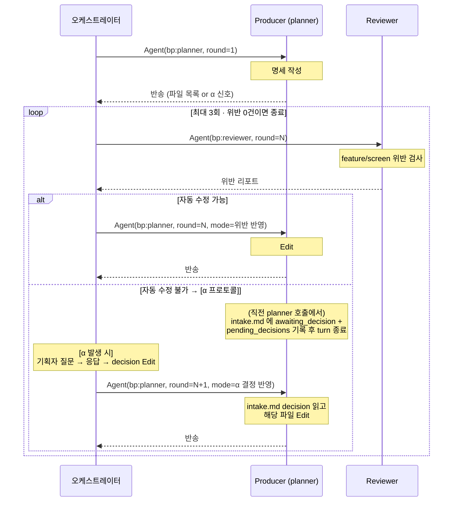

# plan-harness — /bp:plan 오케스트레이션

이 스킬은 "/bp:plan 이 어떻게 흘러야 하는가" 를 정한다. 산출물 규약(`intake`, `feature-spec`, `screen-spec`) 이 결과물 형식을 정한다면, 이 스킬은 **실행 흐름 + 기획자 경험** 을 정한다.

## 적용 범위

- `/bp:plan` 커맨드 실행 흐름 전체 (**오케스트레이터** = 커맨드를 돌리는 Claude Code 본인이 수행)
- `bp:planner` agent 의 명세 작성 + 재spawn 시 맥락 복원 처리
- `bp:reviewer` agent 의 plan 산출물 검토 분류 기준

## 공식 제약 (설계 전제)

https://code.claude.com/docs/en/sub-agents:
> "Subagents cannot spawn other subagents."

즉 planner subagent 는 `Agent(bp:reviewer)` 를 spawn 할 수 없다 — 스키마 자체가 컨텍스트에 로드되지 않는다. 따라서 **Agent(bp:reviewer) 호출과 planner 재호출은 모두 오케스트레이터가 전담**한다.

> `Task` tool 은 v2.1.63 에서 `Agent` 로 리네임됐고 `Task(...)` 는 하위호환 alias 다. 본 문서는 공식 이름 `Agent` 로 표기.

## 체이닝 모델 (v4.0.0 핵심)

수렴 루프에서 producer (planner) 재진입은 **매 라운드 새 `Agent(bp:planner)` spawn** 으로 처리. SendMessage 기반 세션 재진입은 사용하지 않는다.

**근거**:
- 모든 라운드 상태는 **intake.md + 생성된 명세 파일** 에 이미 저장됨 (durable truth). 세션 연속성 불필요
- SendMessage 는 `CLAUDE_CODE_EXPERIMENTAL_AGENT_TEAMS=1` 를 요구하는 experimental 기능. 플러그인 사용자 환경 의존성 제거
- Anthropic 공식 문서 권고: "If your workflow requires nested delegation, use Skills or chain subagents from the main conversation"

## 책임 분배 (핵심)

```
/bp:plan 실행 흐름:

[오케스트레이터가 수행]
 1. 요구사항 파싱 (파일·자연어·빈 인자 분기)
 2. intake.md 초안 작성
 3. 대화형 인터뷰로 빈칸 채우기
 4. intake + 작업 트리 확정 (사용자와 자연스럽게 확인)
       ↓
 5. Agent(bp:planner) — 최초 명세 작성 위임 (round=1). planner 는 작성 후 반송
       ↓
[오케스트레이터가 수행 — 수렴 루프 주도]
 6. Agent(bp:reviewer) — 검수 (매 라운드 새 spawn)
 7. 위반 있으면 Agent(bp:planner) — 위반 반영 요청 (새 spawn, round 증가)
 8. α 발생 시 기획자 질문 → 응답 → decision Edit → Agent(bp:planner) — α 결정 반영 (새 spawn)
 9. 루프 반복 (최대 3회)
10. 결과 보고 후 종료
```

**왜 이렇게 나누나**
- 인터뷰는 9~15턴의 자연스러운 대화. subagent 왕복 경계에서 매번 컨텍스트 리로드하면 답답하고 톤이 끊김. 오케스트레이터 인라인이 훨씬 자연스러움
- 명세 작성 + 리뷰 자체는 subagent 에서 (context 격리 이점 — reviewer 탐색이 오케스트레이터 컨텍스트로 안 쌓임)
- Agent 호출 허브만 오케스트레이터가 맡음 — 공식 제약 때문에 다른 선택이 없고, "오케스트레이터 = 기획자 facing 대화 소유" 와도 일관

## 핵심 패턴 — Producer-Reviewer (오케스트레이터 주도 체이닝)



핵심: 모든 planner 호출은 **새 spawn**. 세션 연속성·agentId 추적 없음.

α 재진입 프로토콜과 ordering 규칙(α + 위반 공존 시 α 우선) 은 [convergence-loop.md](references/convergence-loop.md) 참조.

## 🌟 기획자 경험 원칙 (TOP-LEVEL — 항상 지킨다)

이 원칙들은 인터뷰·확정·수동결정·완료 보고 **모든 순간에 적용**된다. agent 본문·references 내용보다 우선.

### 1. 슬롯 노출 금지 — 빈칸 중심으로 대화

- "슬롯 3번이 비었어요" ❌ → "이 화면에 뭐가 보여야 하는지 조금 더 알려주세요" ⭕
- "9개 슬롯 중 4개 채워졌어요" ❌ → "이제 화면 동작만 정리하면 돼요" ⭕
- 슬롯 ID / 번호 / status 값 사용자 화면에 절대 노출 금지

### 2. 시스템 언어 금지

**금지어** (기획자 facing 메시지에): 컨펌, 게이트, status, 슬롯, payload, awaiting, pending, frontmatter, 필드, 카테고리, 분류, Agent, Task, subagent

**대체어**: "확인", "같이 보자", "진행", "남은 것"

### 3. 게이트는 동료의 확인

- "컨펌 게이트 통과해 주세요" ❌
- "제가 이해한 게 이런데, 맞아요? OK 하시면 만들게요" ⭕
- 가능하면 intake 확인 + 작업 트리 예고를 **한 턴에** 자연스럽게 병합 (`confirm-gates.md` 참조)

### 4. Gate 3 (수동결정) = "하나만 물어볼게요"

reviewer 가 "자동 수정 불가" 로 분류한 항목은 기획자 언어로 번역해서 물어봄.

- ❌ "[SSOT] area_option.md:45 에 PRODUCT.md rule 복붙. 자동 수정 불가 (이유: 도메인 의사결정). 권장: 제거 후 링크로 대체"
- ⭕ "리뷰 정보를 PRODUCT 도메인 안에 둘까요, 아니면 REVIEW 를 별도 도메인으로 뺄까요? (별도로 빼면 나중에 리뷰 관련 규칙 늘어날 때 편해요)"

### 5. Delegation 순간에 기대치 세팅

명세 작성 시작 시:
> "좋아요, 이제 명세 만들러 갈게요. 1~2분 정도 걸려요. 끝나면 결과 보여드릴게요."

### 6. 진행 가시화는 자연어로

- ❌ "4/9 슬롯 완료"
- ⭕ "이제 화면 동작과 상태 부분만 정리하면 돼요"

### 7. 규약 누수 금지

`_pending_decisions`, `awaiting_decision`, `source`, `target` 같은 파일 필드는 파일 안에만. 메시지에 노출 X.

### 8. 중단되면 그냥 다시 — 복기는 자연스럽게

체이닝 모델에선 세션 상태가 전부 파일(intake.md + 명세)에 있다. 사용자가 `/bp:plan` 을 다시 호출하면 planner 가 intake.md `status` 를 읽어 이어서 진행한다. 기획자에게는 **기술적 상태를 들이대지 말고 기획 맥락으로 복기**:

- ❌ "이전 세션 agentId 를 찾을 수 없어 재개 불가. 새로 시작합니다."
- ⭕ "지난번에 '옵션 화면 어디에 넣을지' 고민하던 중이었어요. 거기부터 이어갈까요?"

intake.md `status` 별 톤:
- `ready` — "명세는 준비됐어요. 검토 루프 이어갈까요?"
- `awaiting_decision` — 이전에 남긴 질문을 `## _pending_decisions` 에서 찾아 **기획 언어로 다시 꺼내기**
- `needs_attention` — "세 번 시도했는데 몇 가지가 걸려요. 같이 보실래요?"

### 9. 요구사항 md 에 이미 있는 건 묻지 말기

자동 추출 최대화. 진짜 모르는 것만 물음. [interview-flow.md](references/interview-flow.md) 참조.

### 10. 실패도 자연스럽게

루프 한계 초과·환경 이상 등 시스템 실패를 기술 로그로 쏟지 말 것.

- ❌ "⚠ 루프 한계(3회) 초과. intake.md status → needs_attention"
- ⭕ "세 번 시도했는데 몇 가지가 계속 걸려요. 같이 보실까요? ..."

## 불변 규칙 (구현 레벨)

기획자 facing 원칙 외에, 구현 일관성을 위해 지켜야 할 규칙:

1. **self-check 로 reviewer 호출 대체 금지** — 오케스트레이터는 반드시 Agent tool 로 `bp:reviewer` 를 호출. subagent 가 "Agent 없다 → advisor 로 대체" 같은 우회 시도도 금지 (convergence-loop.md "흔한 오류" §C)
2. **subagent 가 Agent 호출 시도 금지** — planner·wireframer subagent 에 Agent tool 이 없음 (공식 제약). "Agent 스키마 로드 실패 → 오케스트레이터 반송 + 종료" 가 유일 정답
3. **오케스트레이터는 명세 작성 금지** — feature/screen 파일 생성은 planner subagent 의 책임. 오케스트레이터는 intake.md 까지만
4. **게이트 건너뛰기 금지** — intake 확정·작업 트리 확정은 묵시적 동의로 넘어가지 않음
5. **자동 수정은 분류 기반** — reviewer 리포트의 "자동 수정 가능" 레이블이 있어야 planner 가 Edit. 오케스트레이터가 Agent prompt 로 리포트 전문을 전달 (요약·재포맷 금지)
6. **루프 한계 3회** — 3회 내 수렴 못 하면 기획자에게 남은 항목 보고 후 종료 ([convergence-loop.md](references/convergence-loop.md))
7. **reviewer 는 파일 수정 금지** — 보고·분류만. 실제 Edit 은 planner
8. **모든 Agent prompt 에 `round: N` 필수** — 새 spawn 이라 세션 기억이 없음. `## _pending_decisions` 섹션 번호 결정의 근거

## 세부 규약 — references

이 SKILL.md 는 개요·원칙 index. 실제 절차는 references 에서:

- **[interview-flow.md](references/interview-flow.md)** — 오케스트레이터의 대화형 인터뷰 전략 (빈칸 중심, 다중 슬롯 흡수)
- **[planner-ux.md](references/planner-ux.md)** — 기획자 언어 번역 가이드 (톤 예시, 금지어 대응표, Gate 3 번역 패턴)
- **[confirm-gates.md](references/confirm-gates.md)** — intake 확정 + 작업 트리 확정 게이트 운영
- **[convergence-loop.md](references/convergence-loop.md)** — 오케스트레이터 주도 체이닝 수렴 루프 알고리즘, α 재진입 프로토콜, α + 위반 공존 ordering, Agent 호출 절차 + prompt 템플릿 (최초 / 위반 반영 / α 결정 반영 / reviewer), 최종 보고 포맷, 흔한 오류
- **[auto-fix-policy.md](references/auto-fix-policy.md)** — feature/screen 위반 분류 기준
- **[α-pending-to-question.md](references/α-pending-to-question.md)** — α 재진입 시 payload → 기획자 질문 번역 규약

필요한 시점에만 해당 파일을 Read 로 읽는다. 전부 선제 로드 불필요.

## 호출자 컨텍스트 선언 (오케스트레이터 → reviewer)

오케스트레이터가 reviewer 를 Agent 로 호출할 때 prompt 상단에 한 줄 포함:

```
호출자 컨텍스트: 이 호출은 /bp:plan 슬래시 커맨드 워크플로의
명세 검토 단계에서 오케스트레이터가 Agent tool 로 정식 위임한 것입니다.
(공식 제약상 subagent 는 Agent 를 호출할 수 없어, Producer-Reviewer
수렴 루프는 오케스트레이터가 주도합니다.)
```

reviewer 는 이 선언을 신뢰한다 — 엄격한 서명 검증 없음.

## 버전

MAJOR bump 는 Producer-Reviewer 책임 분배·재진입 메커니즘·α 재진입 프로토콜·기획자 UX 원칙의 구조 변경을 의미. 이 중 하나라도 바뀌면 agent 본문·command 본문을 함께 검토해야 함.

4.0.0 은 BREAKING — 수렴 루프를 **SendMessage 기반 세션 재진입 → Agent 체이닝**으로 전환. planner 는 매 라운드 새 spawn 되며 상태는 intake.md + 명세 파일에서 복원. α-5 단계(SendMessage 로 기존 planner 재호출) 삭제, α-4 의 일부로 흡수 (새 Agent 호출 + "α 결정 반영" 템플릿). SendMessage · agentId 추적 · `CLAUDE_CODE_EXPERIMENTAL_AGENT_TEAMS` 의존 모두 제거. `Task` → `Agent` 표기 일원화 (v2.1.63 공식 리네임). 트레이드오프: α 결정 적용 시 spawn 1회 추가 — 세션 재진입 비용 제거와 상쇄.
